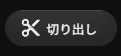
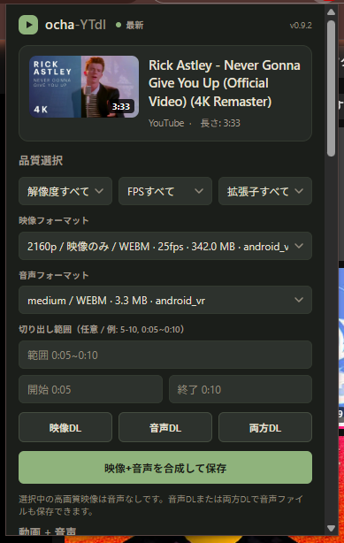

# ocha-YTdl

YouTube の動画ページに **切り出し** ボタンを足す Chrome Manifest V3 拡張機能です。再生位置から範囲を指定して、画質を選んで保存できます。サーバも外部ツールも使わず、ダウンロードも合成もブラウザ内で完結します。

English README: [README_EN.md](README_EN.md)

## ローカルインストール

1. Chrome で `chrome://extensions` を開く
2. `デベロッパー モード` を有効にする
3. `パッケージ化されていない拡張機能を読み込む` をクリック
4. このリポジトリのフォルダを選択する

## 更新方法

Chrome Web Store 経由ではないため、GitHub 上の更新は自動では反映されません。

ZIP をダウンロードして上書きする方法と、`git pull` で更新する方法を [docs/UPDATE_JA.md](docs/UPDATE_JA.md) にまとめています。

Git で導入している場合は、リポジトリ内で次のコマンドを実行できます。

```powershell
powershell -ExecutionPolicy Bypass -File tools\update-local.ps1
```

更新後は `chrome://extensions` で `ocha-YTdl` を再読み込みしてください。

## 使い方

動画ページを開くと、高評価や共有と並んで **切り出し** ボタンが出ます。



押すと、その下にパネルが開きます。

1. **範囲**（任意）— 動画をシークして `現在位置` を押すと開始・終了が入ります。時刻を手で打つ必要はありません。指定しなければ全長を保存します。
2. **保存** — 画質・形式・音声を選んで `保存` を押します。
3. 小さなウィンドウが開いて取得と合成を行い、終わると自動で閉じます。

このウィンドウはページから独立しているので、**ダウンロード中に別の動画へ移動しても中断しません**。

## うまくいかない動画は拡張アイコンから

ページ内のパネルは、PO Token も署名解決も要らないクライアント（`android_vr` / `visionos`）だけを使います。これらが拒否された動画では、パネルにその旨が表示されます。

その場合はツールバーの ocha-YTdl アイコンを押してください。こちらは PO Token の生成、`n` challenge / signature の解決、複数クライアントのフォールバックまで行うため、ページ内で取れない動画でも取得できることがあります。フォーマットの全一覧（映像のみ・音声のみを含む）もこちらから選べます。



## 機能

- 通常の YouTube 動画ページと Shorts URL に対応
- 動画ページ内で、再生位置から切り出し範囲を指定
- 画質・形式・音声を選んで保存（映像と音声はブラウザ内の ffmpeg.wasm で合成）
- ダウンロードは独立したウィンドウで実行するため、ページを離れても中断しない
- 拡張アイコンのパネルでは、フォーマットの全一覧（動画+音声 / 映像のみ / 音声のみ）を表示
- 720p/1080p などの adaptive format を取得するため、複数の YouTube Innertube クライアントを試行
- YouTube の `n` challenge / signature を sandbox ページ内で解決
- PO Token の生成・検出を試行し、高解像度フォーマットの取得成功率を改善
- ページ内のUIも実行ウィンドウも、YouTube のライト/ダークテーマに追従
- GitHub 上の互換性メタ JSON を確認し、YouTube 抽出ロジックの更新推奨を表示

## フォルダ構成

```text
manifest.json
src/
  background.js
  config/
    youtube.js
  generated/
    ytdlp-meta.json
  popup.html
  popup.js
sandbox/
  muxer.html
  potgen.html
  solver.html
vendor/
  astring.min.js
  bgutils/
  ffmpeg/
  meriyah.min.js
  yt.solver.core.js
tools/
  check-ytdlp-upstream.mjs
  probe-formats.mjs
  update-local.ps1
  update-ytdlp-vendor.mjs
docs/
  UPDATE_JA.md
  compat/
    latest.json
  images/
    sc.png
```

この拡張機能はビルド工程なしで動作する構成です。`manifest.json` と HTML 内のパスは、このフォルダ構成を前提にした相対パスです。

## 互換性メタと更新推奨

YouTube 抽出周りは yt-dlp 側でも頻繁に変更されます。この拡張機能は実行時に外部 JavaScript/WASM を読み込まず、同梱済みコードだけで動作します。

代わりに、`src/generated/ytdlp-meta.json` と GitHub 上の `docs/compat/latest.json` を比較し、同梱ロジックが古い可能性がある場合だけポップアップに更新推奨を表示します。この取得は JSON データの確認のみで、リモートコード実行は行いません。

API key、Innertube クライアント定義、client header 番号、PO Token 関連の差し替え点など、YouTube 側の変更で触りやすい値は `src/config/youtube.js` に集約しています。

リポジトリでは GitHub Actions が `tools/update-ytdlp-vendor.mjs` を定期実行します。yt-dlp の最新リリースが要求する `yt-dlp-ejs` wheel から EJS core を取得し、Chrome 拡張向けパッチを当てたうえで `vendor/yt.solver.core.js`、`src/generated/ytdlp-meta.json`、`docs/compat/latest.json` を更新する PR を作成します。

手元で同じ処理を実行する場合:

```bash
node tools/update-ytdlp-vendor.mjs --sync-compat
```

## 注意点

YouTube では 720p/1080p などの高画質フォーマットが、音声なしの「映像のみ」として配信されることが多いです。その場合、拡張機能でダウンロードした高画質ファイルには音声が含まれません。

映像と音声は個別保存できます。また、選択した映像と音声の組み合わせは `sandbox/muxer.html` 上の ffmpeg.wasm で合成できます。再エンコードは行わず、可能な組み合わせでは `mp4`、それ以外は `mkv` として保存します。

時間指定を入力した場合は、対象ファイルを取得したあと `sandbox/muxer.html` 上の ffmpeg.wasm で `-c copy` による切り出しを行います。`5-10`、`0:05~0:10`、`1:02:03-1:03:00` のように入力できます。再エンコードしないため高速ですが、動画によってはキーフレーム位置の都合で開始位置が少し前後することがあります。

合成処理はブラウザのメモリ上で実行されます。大きいファイルではメモリ不足で失敗する場合があるため、その場合は解像度を下げるか、映像と音声を個別に保存してください。

一部の高画質フォーマットは通常 GET では `403` になり、HTTP Range 付きリクエストでのみ取得できます。この拡張機能は該当する URL を検出した場合、Range を並列分割取得してから Blob として保存します。

ただし、先頭 Range だけ通って後続 Range が `403` になる URL は保存できません。その場合はダウンロード前に拒否します。

一部のフォーマットは YouTube 側の PO Token や、ブラウザ拡張だけでは単一ファイルとして扱いにくい配信方式を必要とする場合があります。この拡張機能は PO Token の生成と googlevideo リクエストからの検出を試行しますが、YouTube 側の変更により高解像度フォーマットの取得や保存に失敗することがあります。

360p 以外が表示されない場合は、ポップアップ下部に表示される取得元サマリを確認してください。`android` または `ios` が 720p/1080p を返していない場合、YouTube 側の制限や一時的な API 失敗の可能性があります。

ローカルでフォーマット URL を検証する場合:

```bash
node tools/probe-formats.mjs https://www.youtube.com/shorts/c504uRvrT-s
```

## 同梱している依存ファイル

このリポジトリでは、ビルドなしで拡張機能を読み込めるように `vendor/` 配下へブラウザ向け JavaScript ファイルを同梱しています。

- `vendor/meriyah.min.js`: Meriyah JavaScript parser
- `vendor/astring.min.js`: Astring JavaScript code generator
- `vendor/bgutils/`: PO Token / BotGuard 関連処理
- `vendor/ffmpeg/`: 映像と音声の合成に使う ffmpeg.wasm
- `vendor/yt.solver.core.js`: `yt-dlp-ejs` wheel 由来の EJS core に Chrome 拡張向けパッチを当てた生成ファイル

詳細は [THIRD_PARTY.md](THIRD_PARTY.md) を参照してください。
