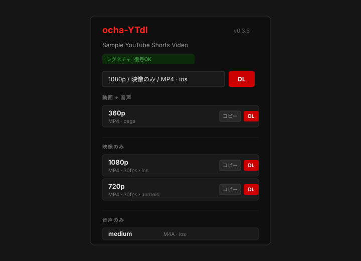

# ocha-YTdl

Chrome Manifest V3 extension for inspecting and downloading YouTube video formats from the current tab.



## Features

- Supports regular YouTube watch pages and Shorts URLs.
- Lists muxed video+audio, video-only, and audio-only formats.
- Provides separate selectors for resolution, FPS, extension, and audio format.
- Muxes the selected video and audio in the browser with ffmpeg.wasm.
- Attempts multiple YouTube Innertube clients to expose adaptive formats such as 720p and 1080p when available.
- Resolves YouTube `n` and signature challenges in a sandboxed page.
- Attempts PO Token generation and capture to improve high-resolution format access.
- Enables the extension action on YouTube tabs and disables it elsewhere.
- Checks hosted compatibility metadata JSON and shows an update recommendation when bundled YouTube extraction logic may be stale.

## Install locally

1. Open `chrome://extensions`.
2. Enable `Developer mode`.
3. Click `Load unpacked`.
4. Select this repository folder.

## Updating

Because this is an unpacked extension, Chrome does not automatically pull updates from GitHub.

Japanese update instructions for ZIP overwrite and `git pull` installs are available in [docs/UPDATE_JA.md](docs/UPDATE_JA.md).

For Git-based installs, run this from the repository:

```powershell
powershell -ExecutionPolicy Bypass -File tools\update-local.ps1
```

After updating files, reload `ocha-YTdl` from `chrome://extensions`.

## Layout

```text
manifest.json
src/
  background.js
  generated/
    ytdlp-meta.json
  popup.html
  popup.js
sandbox/
  muxer.html
  potgen.html
  solver.html
vendor/
  astring.min.js
  bgutils/
  ffmpeg/
  meriyah.min.js
  yt.solver.core.js
tools/
  check-ytdlp-upstream.mjs
  probe-formats.mjs
  update-local.ps1
docs/
  UPDATE_JA.md
  compat/
    latest.json
  images/
    popup-sample.svg
```

The extension is intentionally build-free. All paths in `manifest.json` and HTML files are relative to this repository layout.

## Compatibility Metadata

YouTube extraction changes frequently in yt-dlp. This extension does not execute remote JavaScript or WebAssembly at runtime; it only runs code bundled in the extension package.

Instead, it compares bundled metadata in `src/generated/ytdlp-meta.json` with hosted JSON metadata at `docs/compat/latest.json` and displays an update recommendation when the bundled logic may be stale. This is data-only JSON fetching, not remote code execution.

The repository includes a GitHub Actions workflow that runs `tools/check-ytdlp-upstream.mjs` on a schedule. When the latest yt-dlp release is newer than the bundled metadata, it updates `docs/compat/latest.json` and opens a pull request.

## Notes

YouTube commonly serves 720p/1080p as video-only adaptive formats. Downloaded high-resolution files may not include audio.

The extension can save video and audio separately. It can also mux the selected video and audio through ffmpeg.wasm in `sandbox/muxer.html`. It uses stream copy without re-encoding; compatible combinations are saved as `mp4`, and other combinations are saved as `mkv`.

Muxing runs in browser memory. Large inputs can fail because of memory limits, so choose a lower resolution or download video and audio separately if muxing fails.

Some high-resolution formats return `403` for plain GET requests and only work with HTTP Range requests. When detected, this extension downloads those formats in parallel ranged chunks and saves them as a Blob.

URLs that only allow the first range and reject later ranges cannot be saved. The extension rejects them before starting the download.

Some formats may require YouTube-side PO Tokens or streaming protocols that are not directly downloadable as a single file from a browser extension. This extension attempts both PO Token generation and capture from googlevideo requests, but high-resolution access can still fail when YouTube changes its behavior.

If only 360p is shown, check the fetch summary near the bottom of the popup. If `android` or `ios` did not return 720p/1080p, the limitation is likely coming from YouTube's response or a temporary API failure.

To probe format URLs locally:

```bash
node tools/probe-formats.mjs https://www.youtube.com/shorts/c504uRvrT-s
```

## Vendored code

- `vendor/meriyah.min.js`: Meriyah JavaScript parser.
- `vendor/astring.min.js`: Astring JavaScript code generator.
- `vendor/bgutils/`: PO Token / BotGuard helpers.
- `vendor/ffmpeg/`: ffmpeg.wasm used for muxing video and audio.
- `vendor/yt.solver.core.js`: generated from yt-dlp ejs logic, with the original SPDX header preserved.
